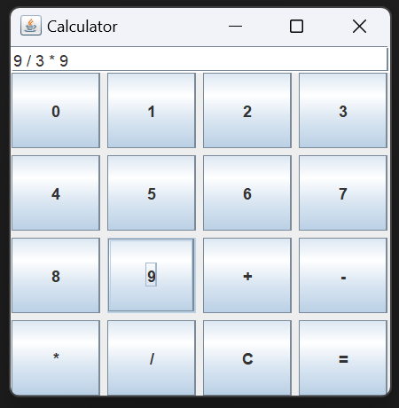
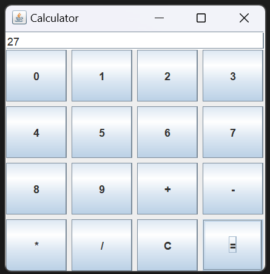

# Simple-Calculator
A simple Calculator with GUI using Java

# Introduction

This project is a Java-based graphical calculator application that provides a user-friendly interface for performing basic arithmetic operations. Built using the Swing library, the calculator supports sequential input of numbers and operators, mimicking the functionality of a standard handheld calculator. The graphical interface is simple, with a grid layout for the buttons and a text field for displaying inputs and results.

# Description:
The calculator's interface consists of a grid of buttons representing digits (0-9), arithmetic operators (+, -, *, /), a clear button (C), and an equals button (=). The core functionality is handled by capturing user input and appending it to a StringBuilder object, which stores the entire arithmetic expression. When the user presses the = button, the application evaluates the expression and displays the result. The calculator handles multiple inputs and operations in sequence, allowing users to perform complex calculations in a straightforward manner. The evaluate method processes the stored expression by tokenizing it and applying the appropriate arithmetic operations.

# Output Images

# Conclusion:
This Java calculator project demonstrates the creation of a functional and intuitive calculator using the Swing framework. It effectively handles sequential arithmetic operations, providing a robust solution for basic mathematical calculations within a simple graphical interface. The project serves as a practical example of how to implement a calculator that can process multiple inputs, offering a solid foundation for further enhancements such as supporting more complex operations or improving the user interface.
